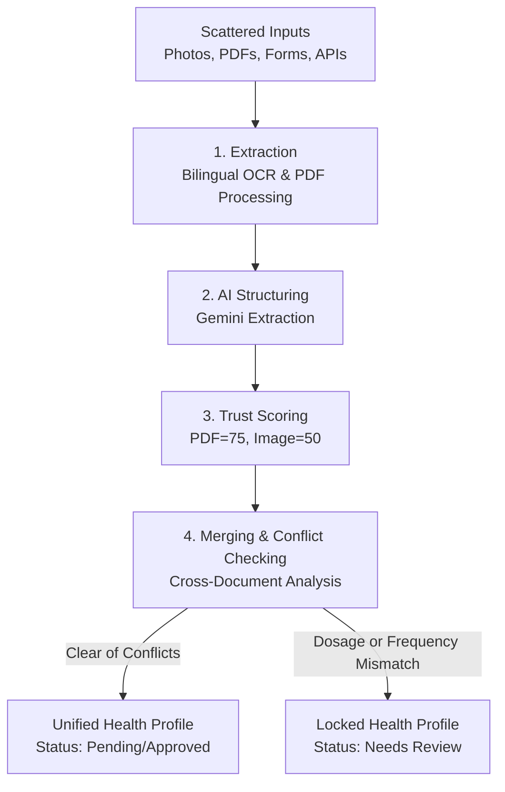

# Hajj Health Platform — Medical Data Unification System

[](https://www.python.org/)
[](https://www.djangoproject.com/)
[](https://deepmind.google/technologies/gemini/)
[](https://opensource.org/licenses/MIT)

A smart, automated health record consolidation and risk prediction platform for Hajj pilgrims. The platform unifies fragmented medical histories, prescriptions, and document uploads into a single, verified health record to empower on-the-ground medical teams with instant, life-saving information.

---

## 🛑 The Core Problem
During Hajj, medical responders treat millions of pilgrims under time-sensitive, high-pressure conditions. However, pilgrim health data is frequently fragmented and difficult to access:
*   Pilgrims arrive with varied medical files (handwritten prescriptions, hospital discharge PDFs, scan reports) written in different languages (predominantly English and Arabic).
*   Data is scattered across manual registration forms, uploaded photos, and external hospital records.

Manually opening, translating, and cross-referencing multiple files during a crisis is impossible. Medical staff need a **single, unified health profile** that acts as the absolute source of truth.

---

## 🔄 System Architecture & Data Flow
The platform automates the pipeline from raw file ingestion to structured, merged records:



### 1. Ingestion & Bilingual Text Extraction
When a pilgrim or administrator uploads a medical file:
*   **PDF Documents:** The system parses multi-page PDF records using `pdfplumber` to extract raw text characters directly.
*   **Images & Photos:** For photographed prescriptions or printouts (JPG, PNG, JPEG), the system executes Optical Character Recognition (OCR) via `pytesseract`. The engine is configured for dual-language recognition (`ara+eng`) to capture Arabic and English medical terms simultaneously.
*   **Cloud Compatibility:** If media is stored on cloud providers (like Cloudinary), the platform streams the file into temporary local storage to run OCR/PDF parsing, cleaning up the temp file immediately after extraction.

### 2. AI-Driven Medical Structuring
Raw extracted text is often messy, fragmented, or written in natural language. The system passes the text to the **Gemini AI model** (`gemini-3.5-flash`) with a schema-forcing prompt. The AI isolates and extracts key clinical data:
*   **Diseases:** Chronic illnesses (e.g., *Type 2 Diabetes*, *Hypertension*).
*   **Medications:** Extracted as distinct objects containing the medication name, dose, and frequency (e.g., *Metformin, 500mg, twice daily*).
*   **Allergies:** Specific substances or drug allergies (e.g., *Penicillin*).
*   **Vaccinations:** Immunization records (e.g., *Meningococcal*, *COVID-19*).

The AI responds with clean, structured JSON, which is validated and stored directly on the document record.

### 3. Confidence & Quality Check
To handle unreadable or low-quality documents, the system rates the reliability of the source data:
*   **Official PDFs:** Receive a baseline confidence score of `75%`.
*   **OCR Image Scans:** Receive a baseline confidence score of `50%` (to account for potential handwriting or camera-blur OCR errors).
*   **Verification Status:** If the document contains no text, or if Gemini AI fails to produce valid structured JSON, the file is automatically marked as `needs_review` and queued for manual human check.

### 4. Smart Profile Merging (The Unified Record)
The platform aggregates data from all approved files associated with a pilgrim into a single **`HealthProfile`**:
*   **De-duplication:** It performs a set union on all diseases, allergies, and vaccinations to produce sorted, clean lists.
*   **Conflict Detection:** While compiling medications, the system checks for dosage or frequency mismatches. If one document lists *Metformin 500mg* and another lists *Metformin 1000mg*, the system detects the dosage mismatch.
*   **Safety Status Assignment:** On detecting any conflict, the entire `HealthProfile` is set to `needs_review` and its confidence score is set to `0`. This locks the profile status, prompting clinical staff to verify the discrepancies before administering treatments.

### 5. Emergency QR Code Access
Every pilgrim is assigned a unique `patient_id` represented as a printable QR code:
*   In an emergency, medical staff scan the QR code using the system's scanning module (built on `pyzbar` and `Pillow`).
*   The system decodes the ID and performs a database lookup, delivering the unified health summary instantly.

---

## 🗃️ Core Database Schema

The backend architecture consists of three key Django models:

*   **`Pilgrim`:** Stores core identity information (full name, passport number, nationality, date of birth) and generates a unique, indexed 12-character `patient_id` (e.g., `5E3D8A2C9B1F`).
*   **`MedicalDocument`:** Manages file uploads. Enforces a 10MB file limit and accepts only PDF, JPG, JPEG, or PNG formats. It holds the raw extracted text, parsed structured JSON, baseline confidence score, and document review status.
*   **`HealthProfile`:** Linked one-to-one with a pilgrim. It contains the unified, aggregated output strings of diseases, medications, allergies, and vaccinations along with the overall validation status (`pending`, `approved`, `needs_review`, `rejected`).

---

## 🛠️ Technology Stack
*   **Backend Framework:** Django (Python)
*   **AI Orchestration:** Gemini API (`gemini-3.5-flash` model integration)
*   **OCR & File Parsing:** `pytesseract` (for image processing) & `pdfplumber` (for PDF text extraction)
*   **QR Scanner Engine:** `pyzbar` & `Pillow`
*   **Cloud Integration:** Django Storage integration (Cloudinary compatible)
*   **Database:** SQLite (Default for development)

---

## 🚀 Getting Started

### Prerequisites
*   Python 3.10 or higher
*   Tesseract OCR engine installed on your local system (required for image processing)

### Setup & Installation

1.  **Clone the Repository:**
    ```bash
    git clone https://github.com/Abo-MLook/hajj_health_platform.git
    cd hajj_health_platform
    ```

2.  **Activate Virtual Environment:**
    *   **Windows:**
        ```powershell
        .\venv\Scripts\activate
        ```
    *   **macOS/Linux:**
        ```bash
        source venv/bin/activate
        ```

3.  **Install Dependencies:**
    ```bash
    pip install -r requirements.txt
    ```

4.  **Configure Environment Variables:**
    Create a `.env` file inside the `backend/` directory with the following variables:
    ```env
    GEMINI_API_KEY=your_gemini_api_key
    CLOUDINARY_CLOUD_NAME=your_cloudinary_cloud_name
    CLOUDINARY_API_KEY=your_cloudinary_api_key
    CLOUDINARY_API_SECRET=your_cloudinary_api_secret
    ```

5.  **Run Migrations:**
    ```bash
    python backend/manage.py migrate
    ```

6.  **Start Development Server:**
    ```bash
    python backend/manage.py runserver
    ```
    Access the local developer dashboard at `http://127.0.0.1:8000/`.
